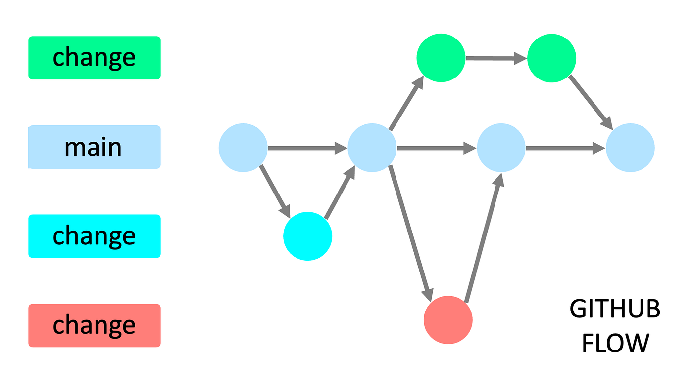
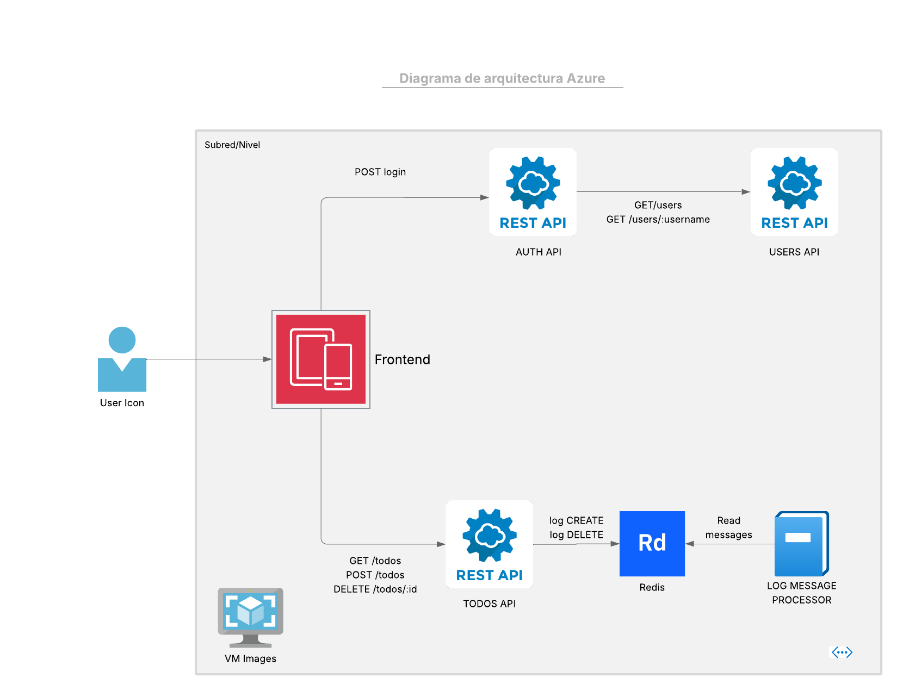

# Workshop 1: Building Cloud Pipelines

Participants

| Names | Code | 
|-------|------|
|Camilo Carmona Valencia | A00381090 |
|Juan Sebastián Libreros García | A00379813 |

## How to run the project

### Locally 

We created a a docker compose file that contains all the instructions that build and deploy the project. All the services have their own Dockerfile. Run the following command beign in the root of the project

```
docker-compose up
```

### Cloud deployment

## Pipelines

## Branching Strategy

### Developement 

For this project we decided to follow the Gitflow strategy. This is strategy has a simple structure composed by only three types of branches: main, dev and feature branches. We followed this strategy since we are only two people on the team and is a really simple project. 



### Operations

Following the same idea that we are a simple team of two developers we decided to create a branch that comes from main called ops, where we stored the pipelines needed to deploy the project 

## Implemented cloud patterns

### Retry pattern

We decided to implement this pattern to prevent the faults caused by unexpected events such as lossing connection or timeouts that occur when the server is busy. **Where we implemented this pattern?** We implemented this patterns in users-api and todos-api. In the first service is located in the service that offers the api to retreive the users since while this may ocurr a failure while the request is beign processed. The same situaton goes for the todos-api, where in the controller the communication between the redis and the service could be lost in any moment we asure that retries after a little amount of time.

### Throttling pattern 

As the retry pattern was implemented we complemented with the throttling pattern to limit the resources that the service uses stopping them when they exceed the limit. **Where we implemented this pattern?**  We implemented this patterns in users-api in the same service at offers the api to retreive the users since could collapse the program if it is over-used.

## Architecture Diagram



